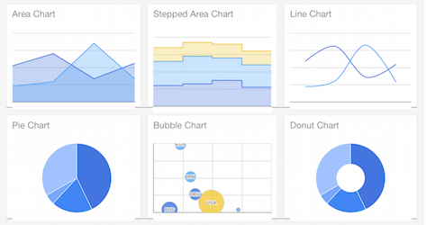
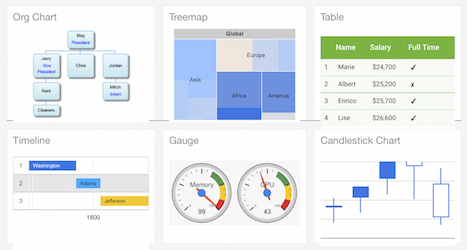

```{r libraries, echo=FALSE, message=FALSE}
library(ggplot2)
library(googleVis)
library(datasets)
suppressPackageStartupMessages(library(googleVis))
op <- options(gvis.plot.tag="chart")
```

## Datasets

We are going to use a simple dataset, called *Fruits* which shows the sales and profit of different fruits across the years 2008-2010.

```{r dataset}
data("Fruits")
head(Fruits)
```

## Charts

I will present here those interesting charts that cannot be made using *ggplot2* or that can gain some additional information by using javascript features on the web.






## Structure of googleVis plotting

In general a plot with this package has this structure:

```{r engine='bash', eval=FALSE}
gvis + chartType (
  data,
  xvar="var1",
  yvar="var2",
  options=list(
    jsOp1="{here}",
    jsOp2="{here}"
  )
)
```

where the list of options correspond to the code in javascript: therefore, it's worth looking at

https://developers.google.com/chart/interactive/docs/gallery

and understanding how the options are "translated" by the R package.

## Line chart with two axes

Line charts in *ggplot2* can only have one Y axis, therefore this might be quite useful.

```{r lineChartSet}
fruitLine <- gvisLineChart(subset(Fruits, Fruits$Fruit=="Apples"), 
                       xvar="Year", 
                       yvar=c("Sales","Profit"),
                       options=list(
                         series="[{targetAxisIndex: 0},
                                 {targetAxisIndex:1}]",
                         vAxes="[{title:'Sales'}, {title:'Profit'}]",
                         width=900
                       )
          )
```

parameters that can have more than one value per sub-options are wrapped in "[ ]".

## Line chart with two axes (plot)

Here is the result of it:

```{r lineChartPlot, results='asis'}
print(fruitLine, "chart")
```


## Bubble Chart

Bubble charts are a very popular way of visualising 3 or 4 different variables at the same time, one of which can be represented as a size of the bubble.

```{r bubbledata}
Bubble <- gvisBubbleChart(Fruits, idvar="Fruit", 
                          xvar="Sales", 
                          yvar="Expenses",
                          colorvar="Year", 
                          sizevar="Profit",
                          options=list(
                            hAxis="{minValue:75, maxValue:125, title:'Sales'}",
                            vAxis="{title:'Expenses'}",
                            width=900
                          )
          )
```


## Plot Bubble

Here is the result:

```{r plotBubble, results='asis'}
print(Bubble, "chart")
```

The advantage of doing it with *googleVis* rather than with *ggplot2* is the interactivity of the display:
if you hoover the mouse over the data points, a number of additional information can be displayed.


## Modify parameters

If we wanted to modify the legend in the bubbles, we can look at

https://developers.google.com/chart/interactive/docs/gallery/bubblechart#customizing-labels

and see that this text in JavaScript belongs to

```{r engine='bash', eval=FALSE}
var options = {
    title: 'Plot',
    hAxis: {title: 'Life Expectancy'},
    vAxis: {title: 'Fertility Rate'},
    bubble: {
      textStyle: {
        fontSize: 12,
        fontName: 'Times-Roman',
        color: 'green',
        bold: true,
        italic: true
      }
    }
  };
```

so, if we wanted to modify that in our R code we will write:

```{r bubbledataModified}
Bubble <- gvisBubbleChart(Fruits, idvar="Fruit", 
                          xvar="Sales", 
                          yvar="Expenses",
                          colorvar="Year", 
                          sizevar="Profit",
                          options=list(
                            hAxis="{minValue:75, maxValue:125, title:'Sales'}",
                            vAxis="{title:'Expenses'}",
                            width=900,
                            bubble="{
                              textStyle:{
                                fontSize: 12,
                                color:'blue'
                              }
                            }"
                          )
          )
```


## Motion charts

This is probably the most famous of the dynamic charts that can be realised thanks to JavaScript, a Motion Chart

```{r motionChart}
M <- gvisMotionChart(Fruits, 
          idvar="Fruit", 
          timevar="Year",
          options=list(
            width=900
          )
     )
```

you can leave blank the *xvar* and *yvar* because they can be dynamically selected, as well as a *colorvar* and *sizevar* which are additional variables like in a *BubblePlot* you can control.

## Motion Chart Plot

And this is the nice result:

```{r motionPlot, results='asis'}
print(M, "chart")
```

if you don't see the plot, it's because when HTML is displayed locally and not from a server, there are Flash Player security settings preventing the plugin to display this dynamic chart.


## Motion Chart Caveats

Motion charts are really nice and dynamic, but unfortunately there are a relevant number of constraints in Google Code to plot them.

See:

https://developers.google.com/chart/interactive/docs/gallery/motionchart

1. the first colum needs to be a "string" and contain the entity names (IDs)
2. the second column needs to contain time values, and specifically a date in an accepted format (Year, Month-Day-Year, Week Number, Quarter) conforming ISO8601
3. each ID needs to exist for each year, so that the combination is unique and there are no missing data

These constraints are understandable, given the type of representation, but makes it use limited to data where timepoints are available for all data and measures.

## Tutorial Exercise

Now consider the same dataset you used for the first tutorial

```{r exercise}
data(mpg)
head(mpg)
```

And try to achieve the same results, but using *googleVis*, and preparing a nice HTML5 presentation.

## Exercise organisation

In order to achieve the best results:

1. **14:15 - 14:40** work alone for 25 minutes - to select one or two plots that represent a different aspect of the data      
Use the online Google API reference        
https://developers.google.com/chart/interactive/docs/gallery        
To select the plots, and decide customisations if needed.

2. **14:40 - 15:00** the selected groups meet and make together the best presentation ever (20 minutes)

3. **15:00 - 15:15** one per group makes a 3 minutes presentation

4. **15:15 - 15:30** we discuss the results, and troubleshooting


